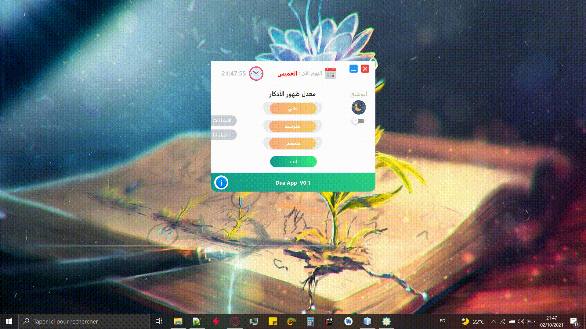
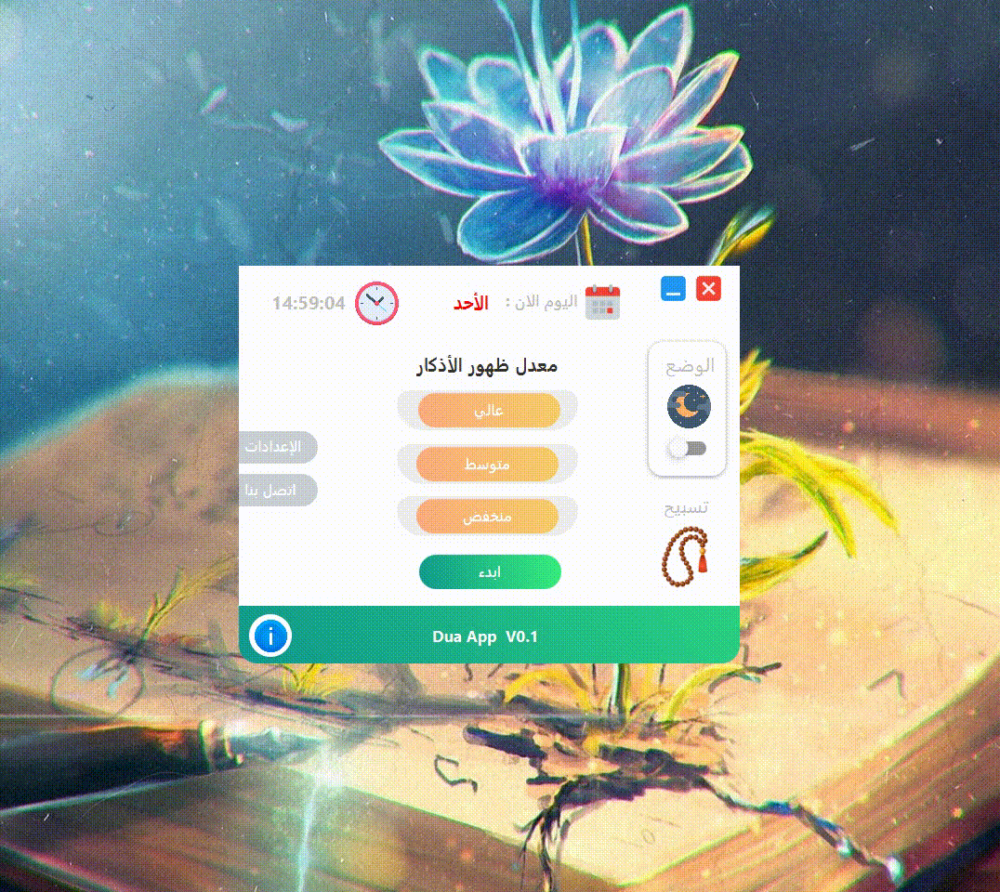

<h1 align="center"> Dua App 🤲 برنامج دعاء </h1>

Desktop Application 💻 for Showing Dua & Azkar 🤲 And Tasbih 📿 .  

برنامج لسطح المكتب 💻 يقوم:
  
- بعرض دعاء كل مدة زمنة محدد 💬 تقوم بتحديدها او تلقائيا كل 5 دقائق 

## Screenshots
Main App           | POP-UP Dua
:---------------------:|:------------------:
  | 
Tasbih            |
  |

(<a href="#top">back to top</a>)

# Download
Download the [Jar file](https://github.com/yassindaboussi/Dua-App/releases)

(<a href="#top">back to top</a>)

## Features
* [x] تحديد معدل ضهور الدعاء  
* [x] اضافة الوضع اليلي
* [x] اضافة الوان مختلفة للاشعارات
* [x] صفحة التسبيح
* [ ] الاعدادات

(<a href="#top">back to top</a>)

## Ressources & Libraries 📚

| Library | icon |
| ------ | ------ |
| JFoenix | [flaticon.com](flaticon.com) |
| AnimateFX | [icones8.fr](icones8.fr) | 
| controlsfx | 
| fontawesomefx | 
| httpclient | 
| httpcore | 
| javafx.mail | 
| json-simple | 
| org.apache.commons.io | 
| TrayTester | 

(<a href="#top">back to top</a>)

## Inspired From
-  [Azkar-App Desktop application](https://github.com/AbdelrahmanBayoumi/Azkar-App)  for Calculating Muslim prayer times, Morning and Nights Azkar with notification .

(<a href="#top">back to top</a>)

## Contributing 💡
If you want to contribute to this project and make it better with new ideas, your pull request is very welcomed.😊😇

(<a href="#top">back to top</a>)

